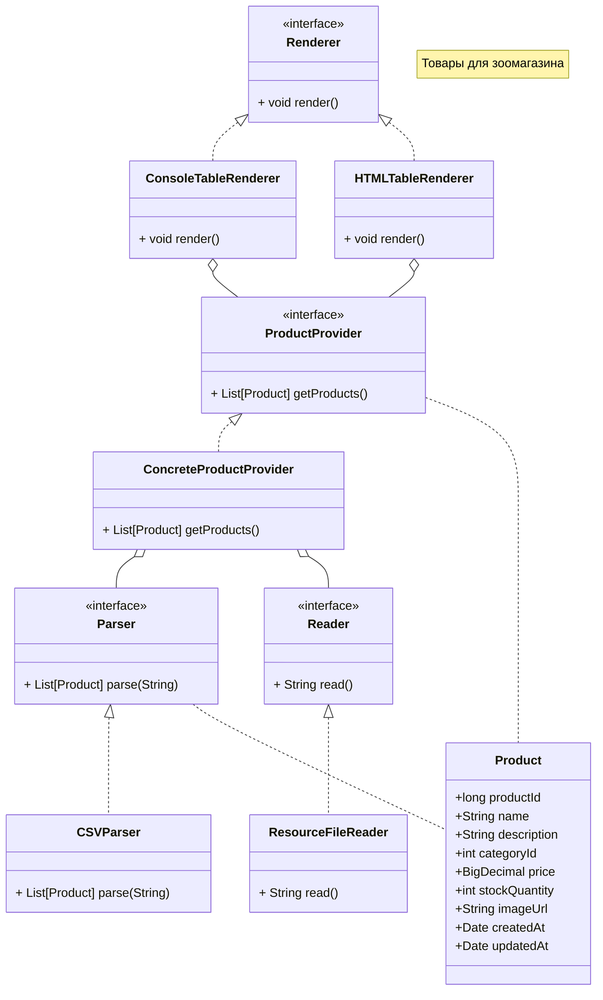

# Отчет о лаботаротоной работе

Оформленн отчёт по выполнению

## Цель работы

Освоить конфигурацию Spring-приложений с использованием аннотаций, включая внедрение зависимостей через `@Component`, настройку параметров с помощью `@Value` и SpEL, а также реализацию новых компонентов и измерение производительности посредством аспектно-ориентированного программирования (AOP). Кроме того, реализовать HTML-представление данных и использовать события жизненного цикла бинов для дополнительной инициализации.

## Выполнение работы

- Настроена конфигурация с применением аннотаций `@Component`, `@Autowired`, `@Value`, `@Primary`.  
- Имя CSV-файла считывается из файла `application.properties`.  
- Данные из CSV парсятся и сохраняются в HTML-файл (`products.html`) с помощью рендерера.  
- С помощью AOP реализовано измерение времени парсинга CSV.  
- Выводится дата инициализации бина `ResourceFileReader`.  

Для запуска использовались команды:  
- `chcp 65001` — настройка консоли для корректного отображения русских символов,  
- `gradle clean build` и `gradle build --refresh-dependencies` для сборки.  
Время сборки — около 2 секунд.

## Диаграмма классов

## Контрольные вопросы

1. **Виды конфигурирования ApplicationContext**  
   - XML-конфигурация  
   - Java-конфигурация (`@Configuration` + `@Bean`)  
   - Аннотационная конфигурация (`@ComponentScan` + стереотипные аннотации)

2. **Стереотипные аннотации**  
   - `@Component` — общий компонент  
   - `@Service` — бизнес-логика  
   - `@Repository` — работа с базой данных  
   - `@Controller` — веб-контроллер  
   - `@RestController` — REST API контроллер

3. **Виды автоматического связывания (autowiring)**  
   - По имени (`byName`)  
   - По типу (`byType`)  
   - Через конструктор

4. **Внедрение простых параметров в бин**  
   - Через `@Value` — прямое значение или из файла конфигурации

5. **Внедрение параметров с помощью SpEL**  
   - Использование выражений Spring Expression Language (арифметика, системные свойства, вызовы других бинов и др.)

6. **Режимы получения бинов**  
   - `singleton` (по умолчанию)  
   - `prototype`  
   - `request`  
   - `session`  
   - `application` и другие

7. **Жизненный цикл бинов**  
   - Создание → Внедрение зависимостей → Вызовы методов Aware → `@PostConstruct` / `init-method` → Работа → `@PreDestroy` / `destroy-method`

8. **Что такое AOP**  
   - Аспектно-ориентированное программирование — выделение сквозной функциональности (логирование, безопасность, транзакции) в отдельные аспекты

9. **Типы AOP в Spring**  
   - Spring AOP (динамические прокси)  
   - AspectJ (байткод-внедрение)

10. **Виды Advice**  
    - `Before`  
    - `AfterReturning`  
    - `AfterThrowing`  
    - `After (finally)`  
    - `Around`

11. **Виды Pointcut**  
    - `execution()`  
    - `within()`  
    - `args()`  
    - `this()`  
    - `target()`  
    - `@annotation()`

12. **Отличия Spring AOP и AspectJ**  
    - Spring AOP — прокси, работает только с методами Spring-бинов  
    - AspectJ — более мощный, внедрение на уровне байткода, поддерживает поля и конструкторы

## Выводы

В ходе лабораторной работы освоена конфигурация Spring с использованием аннотаций и Java-конфигурации. Реализована гибкая загрузка параметров с помощью SpEL, создано HTML-представление данных, а также с помощью AOP измерено время выполнения операций. Использованы события жизненного цикла бинов для вывода информации об инициализации компонентов. Приложение стабильно работает и полностью соответствует требованиям задания.